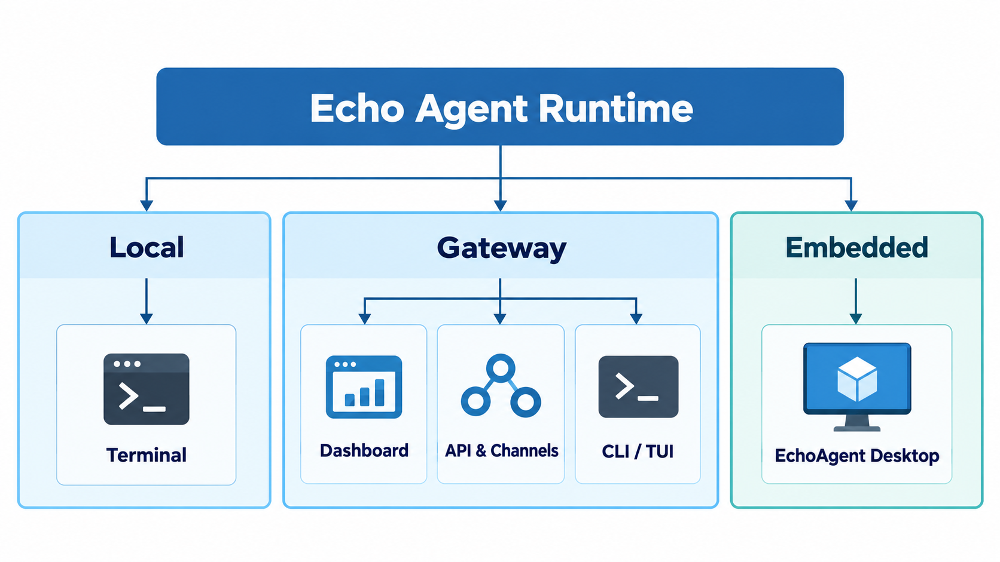

<div align="center">

# Echo Agent

**An open-source Agent Runtime with long-term memory, self-evolving skills, and an embeddable design**

Echo Agent provides a self-hosted runtime for AI assistants and applications that work over time. Cognitive memory retrieves relevant information across sessions, skill evolution creates and evaluates reusable skills from execution experience, and permission policies govern tool calls. Run it in a terminal, operate it as a Gateway service, or embed it in an application; EchoAgent Desktop brings Agent capabilities into a local workbench.

[](https://pypi.org/project/echo-agent/)
[](https://pypi.org/project/echo-agent/)
[](https://github.com/fuyuxiang/echo-agent/actions/workflows/ci.yml)
[](https://fuyuxiang.github.io/echo-agent/en/)
[](LICENSE)
[](https://github.com/fuyuxiang/echo-agent/stargazers)

[Quick start](#quick-start) · [Ways to run](#ways-to-run) · [Memory & evolution](#long-term-memory-and-skill-evolution) · [Desktop](#echoagent-desktop) · [Extensions & integration](#extensions-and-integration) · [Documentation](#documentation) · [中文](README.md)

</div>

## Quick Start

### Agent Runtime

Requirements: Python 3.11+ and an API key for at least one model service. Install the package, configure a model, and start an interactive Agent:

```bash
# Install
pip install "echo-agent[all]"

# Configure a model
echo-agent setup

# Start the Agent in your terminal
echo-agent run
```

If access to PyPI is slow in mainland China, you can use a mirror: `pip install "echo-agent[all]" -i https://mirrors.aliyun.com/pypi/simple/`. The same commands work in Windows PowerShell; see the [installation guide](https://fuyuxiang.github.io/echo-agent/en/getting-started/installation/) for platform dependencies and limitations.

<details>
<summary>Source installation script (Linux / macOS / WSL2)</summary>

The script clones the source, creates a dedicated environment, and runs the setup wizard. Download and review it before running it:

```bash
curl -fsSL -o install.sh https://raw.githubusercontent.com/fuyuxiang/echo-agent/master/scripts/install.sh
less install.sh
bash install.sh
```

Run `bash install.sh --help` for all options.

</details>

See the [installation guide](https://fuyuxiang.github.io/echo-agent/en/getting-started/installation/) for installation methods, optional dependencies, and uninstalling; the [CLI reference](https://fuyuxiang.github.io/echo-agent/en/reference/cli/) for commands; and the [configuration reference](https://fuyuxiang.github.io/echo-agent/en/reference/configuration/) for settings.

To use Dashboard, the API, messaging channels, or scheduled jobs, start Gateway in the foreground:

```bash
echo-agent gateway
```

Dashboard is available at `http://127.0.0.1:58123/` by default.

### Run as a Background Service

`echo-agent run` and `echo-agent gateway` run in the foreground by default. On macOS or Linux with systemd, register Gateway as a user-level background service:

```bash
echo-agent gateway install
echo-agent gateway status
echo-agent gateway logs --follow
```

Gateway listens on `127.0.0.1:58123` by default; use SSH port forwarding for remote access. On Linux, keeping a user service running after logout requires enabling linger according to your system policy. See [background services](https://fuyuxiang.github.io/echo-agent/en/operations/background-service/) and [Gateway authentication](https://fuyuxiang.github.io/echo-agent/en/integrations/gateway/authentication/).

### EchoAgent Desktop

Running the desktop app from source requires Node.js 22 or 24, pnpm 10, Rust 1.92+, and `protoc`. On macOS, run the following from the repository root:

```bash
cd client
pnpm setup:mac
pnpm install --frozen-lockfile
pnpm tauri dev
```

For Windows prerequisites and startup commands, see the [EchoAgent Desktop documentation](client/README.en.md). `pnpm test` runs frontend tests, `pnpm build` checks TypeScript and builds the frontend, and `pnpm dist` creates platform installers. See the [release workflow](client/docs/release-workflow.md) and [automation platform support](client/docs/automation-platform-support.md) for release requirements.

## Ways to Run

Echo Agent supports terminal interaction, Gateway service mode, and embedding in an application:

<div align="center">
  
</div>

| Mode | Entry point | Best for |
| --- | --- | --- |
| **Local** | `echo-agent run` | Terminal interaction, development, and tasks on one machine |
| **Gateway** | `echo-agent gateway` | Long-running service, messaging channels, Dashboard, APIs, and automation |
| **Embedded** | EchoAgent Desktop | Running an Agent inside a host application |

## Long-Term Memory and Skill Evolution

### Cognitive Memory

An Agent can retrieve relevant conversation summaries, user preferences, and project facts across sessions, reducing the need to repeat context. Memory is organized into working context, session summaries, long-term facts, and archives. Hybrid retrieval recalls relevant entries; environment memories decay over time, and conflicting facts are detected and updated. See the [memory system](https://fuyuxiang.github.io/echo-agent/en/concepts/memory-system/).

### Self-Evolving Skills

Echo Agent can distill reusable Skills from task execution traces. Candidate skills undergo content validation and evaluation against a baseline. Low-risk candidates that improve results may be promoted automatically; high-risk candidates enter human review. Promoted skills can be rolled back manually. See [evolution and evaluation](https://fuyuxiang.github.io/echo-agent/en/concepts/evolution-evaluation/).

## Runtime Capabilities

Echo Agent Runtime organizes Agent execution and extensibility around these capabilities:

| Capability | Purpose |
| --- | --- |
| **Agent Loop** | Coordinates model inference, tool calls, and execution feedback to advance a task |
| **Sessions and context** | Manages task state and assembles the context needed for each turn |
| **Model providers and routing** | Connects multiple model services with configurable routing and failover |
| **Tools and MCP** | Uses local tools and connects to external MCP servers |
| **Skills and Plugins** | Loads reusable skills and extends Runtime behavior |
| **Permission policies** | Checks tool calls, prompts for sensitive operations, and records execution |
| **Automation and messaging channels** | Triggers Agents through scheduled jobs, Webhooks, and messaging entry points |

For example, you can analyze a project in the terminal or have Gateway prepare a scheduled report and send it to Feishu or Telegram. See the [architecture overview](https://fuyuxiang.github.io/echo-agent/en/concepts/architecture/) for component responsibilities.

## Gateway and Dashboard

Gateway runs the full Runtime as a service and exposes Dashboard, HTTP / WebSocket APIs, messaging channels, Webhooks, and scheduled jobs. CLI / TUI connects to an existing Gateway and uses its models, memory, tools, and permission policies:

```bash
echo-agent cli
echo-agent cli --tui
```

Dashboard shows sessions, memory, skills, the knowledge base, scheduled jobs, messaging channels, and runtime status. See the [Dashboard guide](https://fuyuxiang.github.io/echo-agent/en/guides/dashboard/) and [messaging channel documentation](https://fuyuxiang.github.io/echo-agent/en/integrations/channels/).

## EchoAgent Desktop

**EchoAgent Desktop** integrates Echo Agent Runtime into a desktop workbench. The Agent can work with files, browsers, and desktop capabilities in a local workspace while showing its execution progress and changes.

<div align="center">
  
</div>

| Use case | Desktop capabilities |
| --- | --- |
| **Coding** | Integrates Eclipse Theia IDE and a Coding Agent for task plans, code changes, diff review, verification, and delivery |
| **Browser and computer use** | Browser Use operates in a task-isolated browser; Computer Use acts on screen snapshots and requests confirmation for sensitive operations |
| **Workspace and knowledge** | Manages project files, sessions, the knowledge base, and task artifacts so the Agent can reuse existing context |
| **Models and extensions** | Selects model services and connects MCP, Skills, Plugins, experts, and sub-Agents as needed |
| **Continue remotely** | With WeChat linked, continue a session, check progress, and handle permission requests while the desktop app is running |

The desktop app can start independently of Gateway. See the [EchoAgent Desktop documentation](client/README.en.md) for source builds, platform requirements, and its full feature set.

## Extensions and Integration

There are two ways to integrate Echo Agent into an existing product:

- **Embed in-process:** The host application integrates Runtime and owns the UI, task state, and local capabilities. EchoAgent Desktop provides a reference [application architecture](client/README.en.md#architecture-and-data-flow) and [runtime bridge](client/src-tauri/src/agent_runtime.rs).
- **Connect to Gateway:** Run Runtime independently and communicate with it through the [HTTP / WebSocket API](https://fuyuxiang.github.io/echo-agent/en/reference/gateway-api/).

The desktop integration is the current reference for in-process embedding. Confirm API behavior and compatibility against the source version you use.

Echo Agent Runtime also offers these extension points:

| Extension point | Purpose | Documentation |
| --- | --- | --- |
| Tools | Add native execution capabilities | [Tool reference](https://fuyuxiang.github.io/echo-agent/en/reference/tools/) |
| MCP | Connect external tool services | [MCP integration](https://fuyuxiang.github.io/echo-agent/en/integrations/mcp/) |
| Skills and Plugins | Reuse workflows and extend runtime behavior | [Skills](https://fuyuxiang.github.io/echo-agent/en/integrations/skills/using-skills/) · [Plugins](https://fuyuxiang.github.io/echo-agent/en/integrations/plugins/using-plugins/) |
| Models | Connect model services | [Model providers](https://fuyuxiang.github.io/echo-agent/en/guides/models/) |
| Channels | Add messaging entry points | [Messaging channels](https://fuyuxiang.github.io/echo-agent/en/integrations/channels/) |

## Data and Security

Echo Agent can run on your own computer or server. Sessions, memory, configuration, and other state remain in the deployment environment. Permission policies govern tool calls; operations that require approval wait for a user decision and are recorded.

When you use remote models, MCP servers, or third-party messaging channels, the data needed for those interactions is sent to the corresponding services. We recommend running only one full Runtime instance per workspace. See the [security model](https://fuyuxiang.github.io/echo-agent/en/concepts/security-model/) and [hardening guide](https://fuyuxiang.github.io/echo-agent/en/operations/security-hardening/) for remote access and deployment boundaries.

## Documentation

Full documentation: [fuyuxiang.github.io/echo-agent/en](https://fuyuxiang.github.io/echo-agent/en/)

| Topic | Entry points |
| --- | --- |
| Getting started | [Installation](https://fuyuxiang.github.io/echo-agent/en/getting-started/installation/) · [Quick start](https://fuyuxiang.github.io/echo-agent/en/getting-started/quickstart/) |
| Core concepts | [Architecture](https://fuyuxiang.github.io/echo-agent/en/concepts/architecture/) · [Agent Loop](https://fuyuxiang.github.io/echo-agent/en/concepts/agent-loop/) · [Memory system](https://fuyuxiang.github.io/echo-agent/en/concepts/memory-system/) · [Evolution and evaluation](https://fuyuxiang.github.io/echo-agent/en/concepts/evolution-evaluation/) |
| Configuration and operations | [Configuration](https://fuyuxiang.github.io/echo-agent/en/reference/configuration/) · [Runtime modes](https://fuyuxiang.github.io/echo-agent/en/operations/runtime-modes/) · [Security hardening](https://fuyuxiang.github.io/echo-agent/en/operations/security-hardening/) |
| Versions and compatibility | [Changelog](CHANGELOG.md) · [Compatibility](https://fuyuxiang.github.io/echo-agent/en/reference/compatibility/) |
| Desktop app | [EchoAgent Desktop](client/README.en.md) |

## Development and Contributing

In this repository, `echo_agent/` contains the core code for terminal and Gateway use, `web/` is the Dashboard frontend, `client/` contains the desktop app, and `skills/` contains built-in Skills. See the [repository map](https://fuyuxiang.github.io/echo-agent/en/development/repository-map/) for the full layout.

On macOS or Linux, set up a development environment and run checks:

```bash
git clone https://github.com/fuyuxiang/echo-agent.git
cd echo-agent
uv venv venv --python 3.11
source venv/bin/activate
uv pip install -e ".[all,dev]"
ruff check .
pytest
```

We welcome bug fixes, Runtime improvements, tools, Skills, Plugins, messaging channels, and documentation. See [CONTRIBUTING.en.md](CONTRIBUTING.en.md) for contribution guidelines.

## Community and Support

- Usage questions and design discussions: [GitHub Discussions](https://github.com/fuyuxiang/echo-agent/discussions)
- Bug reports and feature requests: [GitHub Issues](https://github.com/fuyuxiang/echo-agent/issues)
- Chinese-language chat: [QQ group 47572014](https://qm.qq.com/q/JWOPDBNssw)
- Security vulnerabilities: [GitHub private security reports](https://github.com/fuyuxiang/echo-agent/security/advisories/new); see [SECURITY.md](SECURITY.md) for the disclosure process

## License

Echo Agent is open source under the [MIT License](LICENSE). See the [third-party notices](client/THIRD_PARTY_NOTICES.md) for licenses of components included in the desktop app.
