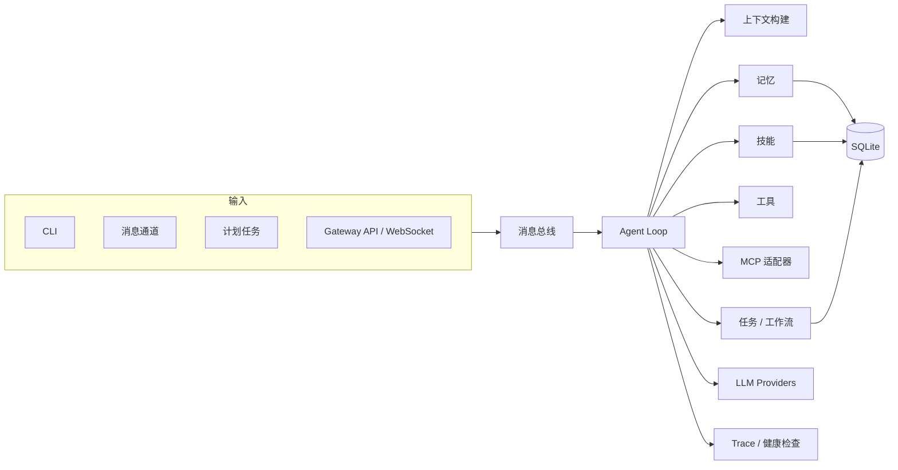

# Echo Agent

<p align="center">
  <strong>面向自托管场景的模块化 AI Agent 运行时。</strong>
</p>

<p align="center">
  <a href="#快速安装">快速安装</a> ·
  <a href="#常用命令">常用命令</a> ·
  <a href="#gateway-api">Gateway</a> ·
  <a href="#架构">架构</a> ·
  <a href="#开发">开发</a>
</p>

<p align="center">
  
  
  <a href="LICENSE"></a>
  
</p>

**Echo Agent** 是一个模块化、自托管的 AI Agent 运行时。一个进程统一处理 CLI、消息通道、计划任务和 Gateway API，内置持久化会话、长期记忆、工具调用、技能沉淀和全链路可观测。可以运行在你自己的机器、一台廉价 VPS 或现有基础设施之上。

支持任意模型 — OpenAI、Anthropic Claude、Google Gemini、AWS Bedrock、OpenRouter 或任何 OpenAI 兼容端点。切换 provider 只需改配置，无需改代码。

<!-- PLACEHOLDER_FEATURES_TABLE -->

<table>
<tr><td><b>多通道统一收发</b></td><td>Telegram、Discord、Slack、WhatsApp、微信、QQ、飞书、钉钉、企业微信、Matrix、Email — 所有通道共享同一个消息总线、Agent Loop 和记忆存储。</td></tr>
<tr><td><b>持久化记忆与技能</b></td><td>用户偏好、环境事实、工作记忆、情节回忆，可选向量索引和知识图谱。技能从经验中沉淀，支持创建、安装和共享。</td></tr>
<tr><td><b>工具调用与审批</b></td><td>40+ 内置工具 — 文件操作、Shell、Web、视觉、TTS、MCP 适配器、知识检索、任务/工作流管理。高风险操作需经权限规则和审批门控。</td></tr>
<tr><td><b>Gateway API</b></td><td>REST + WebSocket 接口，内置 Playground、会话管理、健康检查、认证（allowlist / pairing / token）和 A2A 协议支持。</td></tr>
<tr><td><b>多 Agent 路由</b></td><td>按任务类型路由到专用 Agent — general、planner、coder、researcher、operator，支持调度审计和并行执行。</td></tr>
<tr><td><b>计划任务</b></td><td>内置 cron 调度器，可投递到任意通道。日报、夜间备份、定期巡检 — 无人值守运行。</td></tr>
<tr><td><b>服务化运行</b></td><td>开发用前台 CLI，生产用 systemd 服务。一条命令完成安装、启用和管理。</td></tr>
</table>

---

## 快速安装

```bash
curl -fsSL https://raw.githubusercontent.com/fuyuxiang/echo-agent/main/scripts/install.sh | bash
```

支持 Linux、macOS 和 WSL2。安装脚本自动处理 Python 3.11、依赖安装、PATH 配置，Linux 上可选注册 systemd 服务。

安装完成后：

```bash
source ~/.bashrc          # 或: source ~/.zshrc
echo-agent setup          # 交互式配置向导
echo-agent                # 开始对话
```

### 源码安装

```bash
git clone https://github.com/fuyuxiang/echo-agent.git
cd echo-agent
curl -LsSf https://astral.sh/uv/install.sh | sh
uv venv venv --python 3.11
source venv/bin/activate
uv pip install -e ".[all]"
echo-agent setup -w .
echo-agent run -w .
```

---

## 常用命令

```bash
echo-agent                # 交互式 CLI
echo-agent run            # 前台运行
echo-agent setup          # 完整配置向导
echo-agent setup model    # 配置模型和 provider
echo-agent setup channel  # 配置消息通道
echo-agent status         # 查看当前配置和运行状态
echo-agent gateway        # 启动 Gateway 服务
echo-agent eval -d eval.yaml  # 运行评测数据集
```

### 服务管理（Linux）

```bash
echo-agent service install    # 注册 systemd 服务
echo-agent service start      # 启动服务
echo-agent service status     # 查看服务状态
echo-agent service logs       # 查看服务日志
echo-agent service restart    # 重启服务
echo-agent service uninstall  # 卸载服务
```

---

## 通道

所有通道进入同一个消息总线和 Agent Loop，会话、记忆、工具和权限在各平台间保持一致。

| 分类 | 通道 |
|------|------|
| 本地与系统 | `cli`、`webhook`、`cron` |
| 国际平台 | `telegram`、`discord`、`slack`、`whatsapp`、`email`、`matrix` |
| 国内生态 | `wechat`、`weixin`、`qqbot`、`feishu`、`dingtalk`、`wecom` |

---

## Gateway API

Gateway 将 Echo Agent 暴露为 HTTP / WebSocket 服务，根路径 `/` 提供内置 Playground。

```bash
echo-agent gateway --host 127.0.0.1 --port 9000
```

| 方法 | 路径 | 说明 |
|------|------|------|
| `GET` | `/` | 内置 Playground |
| `GET` | `/api/v1/health` | 健康检查 |
| `POST` | `/api/v1/message` | 发送消息到 Agent |
| `GET` | `/api/v1/sessions` | 查看会话列表 |
| `GET` | `/ws` | WebSocket 接口 |
| `GET` | `/.well-known/agent.json` | A2A Agent Card |
| `POST` | `/a2a` | A2A JSON-RPC 入口 |

认证支持 `open`、`allowlist` 和 `pairing` 三种模式，以及通过 `X-Echo-Agent-Token` 或 `Authorization: Bearer` 传入的 API token。不要将未认证的 Gateway 暴露到公网。

---

## 配置

Echo Agent 按以下顺序查找配置文件：`-c` 参数 > 工作区中的 `echo-agent.yaml` > `~/.echo-agent/echo-agent.yaml`。

最小可用配置：

```yaml
workspace: "~/.echo-agent"

models:
  defaultModel: "gpt-4o-mini"
  providers:
    - name: "openai"
      apiKey: "<YOUR_API_KEY>"

channels:
  cli:
    enabled: true

permissions:
  adminUsers:
    - "cli_user"
```

支持的 provider：`openai`、`anthropic`、`gemini`/`google`、`bedrock`/`aws`、`openrouter`，以及任何 OpenAI 兼容端点。模型路由支持按任务类型匹配、降级模型和凭证池轮换。

环境变量覆盖使用 `ECHO_AGENT_` 前缀，层级间用双下划线分隔（如 `ECHO_AGENT_GATEWAY__PORT=9000`）。

---

<!-- PLACEHOLDER_REST -->

## 记忆与技能

**记忆**分为两层：用户记忆（偏好、习惯、个人上下文）和环境记忆（项目事实、工具配置、领域知识）。支持工作记忆、情节回忆、语义检索、可选向量索引、可选知识图谱、矛盾检测和预测预取。

**技能**使用目录 + `SKILL.md` 格式。内置技能包括 `arxiv`、`weather`、`summarize`、`plan` 和 `skill-creator`。技能可以查看、创建、修改、删除，也可以从本地路径、Git 仓库或 URL 安装。

---

## 工具与权限

40+ 工具按类别组织：

| 分类 | 工具 |
|------|------|
| 工作区 | `read_file`、`write_file`、`edit_file`、`list_dir`、`search_files`、`patch` |
| 执行 | `exec`、`execute_code`、`process` |
| Web | `web_fetch`、`web_search` |
| 协作 | `message`、`notify`、`clarify`、`delegate_task`、`spawn_task` |
| 记忆与会话 | `session_search`、`memory` |
| 任务与工作流 | `todo`、`task`、`workflow`、`cronjob` |
| 技能 | `skills_list`、`skill_view`、`skill_manage`、`skill_install` |
| 多模态 | `vision_analyze`、`text_to_speech`、`image_generate` |
| 知识库 | `knowledge_search`、`knowledge_index` |
| 多 Agent | `agents_list`、`agents_route` |
| MCP | 从配置的 MCP server 动态注册 |

高风险工具（`exec`、`write_file`、`edit_file` 等）默认需要审批。通过 `permissions.adminUsers` 和 `permissions.approval` 控制访问。

---

## 架构



```text
echo_agent/
├── agent/          # Agent loop、上下文构建、压缩、工具执行
├── bus/            # 消息事件队列
├── channels/       # CLI、消息通道、webhook、cron 适配器
├── cli/            # 配置向导、状态查看、服务管理
├── config/         # 配置 schema、加载器、默认值
├── gateway/        # HTTP / WebSocket Gateway
├── mcp/            # MCP 客户端、传输层、OAuth
├── memory/         # 记忆存储、检索、审查、图谱、向量
├── models/         # Provider、路由、凭证池
├── observability/  # 健康检查、Span、遥测
├── permissions/    # 权限和凭证原语
├── scheduler/      # 计划任务服务
├── session/        # 会话持久化
├── skills/         # 技能存储和审查
├── storage/        # SQLite 后端
└── tasks/          # 任务管理和工作流引擎
```

---

## 开发

```bash
git clone https://github.com/fuyuxiang/echo-agent.git
cd echo-agent
uv venv venv --python 3.11
source venv/bin/activate
uv pip install -e ".[all,dev]"

ruff check .
pytest
echo-agent run -w .
```

---

## 安全建议

- 不要将 API key、token 或 `data/credentials.json` 提交到 Git。
- 本地开发优先绑定 `127.0.0.1`。
- Gateway 绑定 `0.0.0.0` 前先启用认证和访问控制。
- Shell/进程/代码执行属于高权限能力，应只开放给可信用户。
- 排查问题先看 `echo-agent status`；生产环境再看 `echo-agent service logs`。

---

## License

MIT

