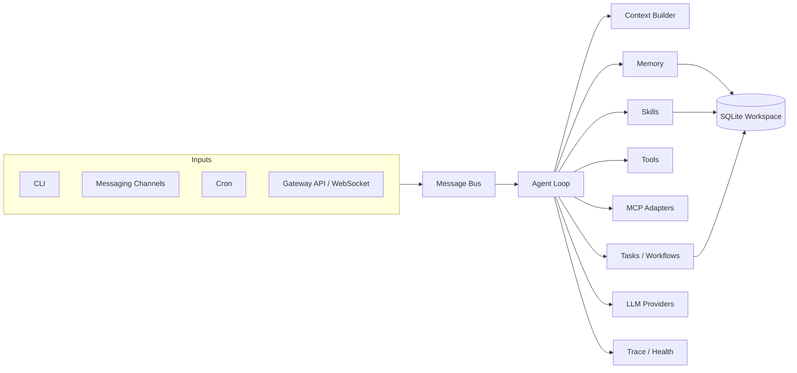

# Echo Agent

<p align="center">
  <strong>面向自托管场景的 AI Agent Runtime。</strong><br />
  用一套核心运行时统一 CLI、消息通道、工具调用、长期记忆、技能沉淀、计划任务和 Gateway API。
</p>

<p align="center">
  <a href="#快速开始">快速开始</a> ·
  <a href="#gateway-api">Gateway API</a> ·
  <a href="#后台运行">后台运行</a> ·
  <a href="#配置">配置</a> ·
  <a href="#开发">开发</a>
</p>

<p align="center">
  
  
  
  
</p>

Echo Agent 是一个模块化的 AI Agent 运行时。它不是单一聊天机器人，而是一套可以长期运行的执行层：从 CLI、消息平台、计划任务或 HTTP/WebSocket Gateway 接收请求，构造带记忆的上下文，调用工具完成任务，并把会话、记忆、任务、工作流、日志和状态持久化到你的工作区。

当前项目处于 **alpha** 阶段。核心运行时、CLI、Gateway、SQLite 存储、记忆、技能、MCP 和多通道适配器已经具备，但仍应按自托管工程系统来部署：谨慎配置权限，保护密钥，不要把未认证的 Gateway 暴露到公网。

## 为什么选择 Echo Agent

- **自托管优先**：配置、日志、会话、记忆、技能和运行状态都可以留在你自己的机器或工作区中。
- **一个运行时，多种入口**：CLI、聊天平台、cron、webhook 和 API 都进入同一个消息总线和 Agent Loop。
- **工具调用是一等能力**：文件、Shell、搜索、视觉、消息、记忆、技能、任务、工作流和 MCP 工具统一注册、统一鉴权。
- **为长期助手设计**：会话持久化、记忆快照、上下文压缩、trace 日志和健康检查是内置能力。
- **可扩展但不重写核心**：新通道、新 provider、新技能、新 MCP server 都可以增量接入。

## 适合做什么

- 本地开发、运维或研究助手，带项目级长期记忆。
- 接入 Telegram、Discord、Slack、微信、QQ、飞书、钉钉、企业微信、Matrix、Email、Webhook 的个人或团队 Bot。
- 通过 REST / WebSocket 提供服务的后端 Agent。
- 能调用本地工具、MCP server 和技能包的任务执行助手。
- 带任务状态、工作流记录、日志和健康检查的长期运行自动化系统。

## 快速开始

### 一键安装

```bash
curl -fsSL https://raw.githubusercontent.com/fuyuxiang/echo-agent/main/scripts/install.sh | bash
```

安装脚本支持 Linux、macOS 和 WSL2，会自动完成：

- 安装 `uv` 和 Python 3.11（如缺失）
- 克隆仓库到 `~/.echo-agent/echo-agent`
- 创建虚拟环境并安装依赖
- 将 `echo-agent` 命令链接到用户 PATH
- 使用 `~/.echo-agent` 作为默认配置和数据目录
- 询问是否运行 setup wizard
- 在 Linux 上询问是否注册 systemd 服务

如果安装后命令还不可用，重新加载 shell：

```bash
source ~/.bashrc
# 或
source ~/.zshrc
```

然后执行：

```bash
echo-agent setup
echo-agent
```

`echo-agent` 默认启动交互式 CLI。如果还没有配置任何模型 provider，运行时会使用 stub provider 启动并返回配置引导信息，而不是发起真实模型调用。

### 源码安装

```bash
git clone https://github.com/fuyuxiang/echo-agent.git
cd echo-agent
curl -LsSf https://astral.sh/uv/install.sh | sh
uv venv venv --python 3.11
source venv/bin/activate
uv pip install -e ".[all]"
echo-agent setup -w .
echo-agent run -w .
```

## 常用命令

```bash
echo-agent                         # 启动 CLI 助手
echo-agent run                     # 显式前台运行
echo-agent setup                   # 交互式配置向导
echo-agent setup model             # 配置模型和 provider
echo-agent setup channel           # 配置消息通道
echo-agent status                  # 查看当前配置和运行状态
echo-agent gateway --port 9000     # 前台启动 Gateway
echo-agent eval -d eval.yaml       # 运行评测数据集
echo-agent service install         # Linux: 安装 systemd 服务
echo-agent service start           # Linux: 启动 systemd 服务
echo-agent service logs            # Linux: 查看服务日志
```

## 后台运行

Echo Agent 明确区分前台进程和服务托管进程。

| 命令 | 行为 |
| --- | --- |
| `echo-agent` / `echo-agent run` | 前台 CLI 进程。可用 `Ctrl+C`、`exit`、`quit` 或 `/quit` 退出。 |
| `echo-agent gateway` | 前台 Gateway 进程。可用 `Ctrl+C` 停止。 |
| `echo-agent service install/start` | Linux systemd 服务。后台运行，并可在失败后自动重启。 |

### Linux systemd

```bash
echo-agent service install -w ~/.echo-agent
echo-agent service start
echo-agent service status
echo-agent service logs
```

该服务会以指定工作目录运行 `echo-agent run`，适合长期运行消息通道、cron 和启用了 Gateway 的部署。

停止或卸载：

```bash
echo-agent service stop
echo-agent service uninstall
```

### macOS 与 WSL2

内置服务管理当前只覆盖 Linux systemd。macOS 或未启用 systemd 的 WSL2 可以在开发时直接前台运行，也可以放到你自己的进程管理器下，例如 `tmux`、`launchd`、systemd 或容器运行时。

```bash
echo-agent gateway --port 9000
```

## Gateway API

Gateway 将 Echo Agent 暴露为 HTTP / WebSocket 服务，适合被其他应用、Web UI、自动化脚本或远程客户端调用。根路径 `/` 提供内置 playground，API 默认前缀为 `/api/v1`。

### 启动 Gateway

```bash
echo-agent gateway -c ~/.echo-agent/echo-agent.yaml --port 9000
```

打开 playground：

```text
http://127.0.0.1:9000/
```

发送消息：

```bash
curl -X POST "http://127.0.0.1:9000/api/v1/message" \
  -H "Content-Type: application/json" \
  -d '{
    "platform": "api",
    "user_id": "demo",
    "chat_id": "demo",
    "text": "请总结当前工作区的目录结构",
    "wait": true,
    "timeout_seconds": 120
  }'
```

### 主要接口

| Method | Path | 说明 |
| --- | --- | --- |
| `GET` | `/` | 内置 playground |
| `GET` | `/api/v1/health` | 健康检查 |
| `POST` | `/api/v1/message` | 发送消息到 Agent |
| `GET` | `/api/v1/sessions` | 查看会话列表 |
| `DELETE` | `/api/v1/sessions/{key}` | 重置指定会话 |
| `POST` | `/api/v1/pair` | 生成配对码 |
| `POST` | `/api/v1/pair/verify` | 校验配对码 |
| `GET` | `/api/v1/stats` | 查看运行统计 |
| `GET` | `/ws` | WebSocket 接口 |

### Gateway 安全

不要把未认证 Gateway 暴露到公网。

本地开发可以使用开放模式：

```yaml
gateway:
  enabled: true
  host: "127.0.0.1"
  port: 9000
  auth:
    mode: "open"
```

如果 Gateway 会被局域网或公网访问，请启用认证模式，并把服务放在可信网络、VPN、SSH tunnel 或带认证的反向代理后面。绑定 `0.0.0.0` 前应先确认认证和访问控制已经配置好。

## 配置

Echo Agent 会按以下顺序查找配置文件：

1. `-c` / `--config` 显式传入的路径
2. 当前目录或指定工作区中的 `echo-agent.yaml`
3. 当前目录或指定工作区中的 `echo-agent.yml`
4. 当前目录或指定工作区中的 `config.yaml`
5. 当前目录或指定工作区中的 `config.yml`
6. 默认 home 目录 `~/.echo-agent/` 下的同名配置文件

默认全局配置文件：

```text
~/.echo-agent/echo-agent.yaml
```

### 最小可用配置

```yaml
workspace: "~/.echo-agent"

models:
  defaultModel: "gpt-4o-mini"
  providers:
    - name: "openai"
      apiKey: "<YOUR_OPENAI_API_KEY>"

channels:
  cli:
    enabled: true

permissions:
  adminUsers:
    - "cli_user"
```

这份配置会：

- 使用 `~/.echo-agent` 作为状态目录
- 使用 OpenAI provider
- 启用 CLI 通道
- 允许本地 CLI 用户 `cli_user` 调用工具

### 环境变量覆盖

所有配置项都可以通过 `ECHO_AGENT_` 前缀环境变量覆盖，层级之间使用双下划线：

```bash
export ECHO_AGENT_MODELS__DEFAULTMODEL=gpt-4o-mini
export ECHO_AGENT_GATEWAY__ENABLED=true
export ECHO_AGENT_OBSERVABILITY__LOGLEVEL=DEBUG
```

### 工作区数据

`workspace` 是 Echo Agent 的状态根目录。默认会写入：

```text
data/echo_agent.db
data/memory/
data/logs/
data/media_cache/
data/credentials.json
```

个人服务建议使用独立目录，例如 `~/.echo-agent`。如果你希望状态和某个项目绑定，可以使用项目本地工作区：

```bash
echo-agent setup -w .
echo-agent run -w .
```

## 通道

Echo Agent 当前包含以下通道适配器：

- 本地与系统：`cli`, `webhook`, `cron`
- 国际通用平台：`telegram`, `discord`, `slack`, `whatsapp`, `email`, `matrix`
- 微信与企业协同生态：`wechat`, `weixin`, `qqbot`, `feishu`, `dingtalk`, `wecom`

所有通道都进入同一个消息总线和 Agent Loop，因此会话、记忆、工具和权限模型可以保持一致。

## 工具与权限

Echo Agent 的工具统一注册到工具体系中，并在执行前经过权限层检查。

内置工具大致分为：

- 工作区与执行：文件读写编辑、目录查看、搜索、patch、Shell/process、代码执行
- Web 与多模态：web fetch、web search、视觉分析、图片生成、文本转语音
- 协作与消息：message、notify、clarify、任务委派
- 记忆与会话：memory、session search
- 技能：list、view、manage、install
- 计划与跟踪：todo、task、workflow
- MCP：由 MCP server 暴露的外部工具

默认权限策略偏保守。如果你希望本地 CLI 可以调用工具，至少需要：

```yaml
permissions:
  adminUsers:
    - "cli_user"
```

面向团队或公网入口时，不建议直接授予广泛 admin 权限，应按通道、用户和工具类型配置更细粒度的权限规则。

## 记忆与技能

Echo Agent 的记忆分为两层：

- **User memory**：用户偏好、长期要求、表达习惯和个人约定
- **Environment memory**：项目事实、运行环境、工具配置和领域知识

记忆支持添加、替换、删除、列表和搜索。运行时可以把相关记忆快照注入上下文，也可以在较复杂的对话后进行后台 review，将值得保留的信息沉淀下来。

技能系统使用目录加 `SKILL.md` 的格式。仓库内置技能包括：

- `arxiv`
- `weather`
- `summarize`
- `plan`
- `skill-creator`

技能可以被查看、创建、patch、删除，也可以从本地路径、Git 仓库或 URL 安装。

## MCP 集成

Echo Agent 可以连接 MCP server，并把 MCP 暴露的工具接入自己的工具体系。

示例：

```yaml
tools:
  mcpServers:
    docs:
      url: "http://127.0.0.1:8081/mcp"
      enabled: true
```

当前实现支持本地 `stdio` server、远程 HTTP server、工具 include/exclude 过滤、OAuth token 存储、重连和工具刷新。

## 架构



项目结构：

```text
echo_agent/
├── agent/          # Agent loop, context builder, compression, tool execution
├── bus/            # Message event queue
├── channels/       # CLI, messaging, webhook, cron adapters
├── cli/            # setup, status, service management
├── config/         # schema, loader, defaults
├── gateway/        # HTTP / WebSocket Gateway
├── mcp/            # MCP client, transports, OAuth, tool adapter
├── memory/         # memory store, retrieval, reviewer, graph, vectors
├── models/         # providers, router, credential pool, rate limiting
├── observability/  # health checks, spans, telemetry
├── permissions/    # permission and credential primitives
├── scheduler/      # scheduled job service
├── session/        # session persistence
├── skills/         # skill store and reviewer
├── storage/        # SQLite backend
└── tasks/          # task manager and workflow engine
```

## 开发

```bash
git clone https://github.com/fuyuxiang/echo-agent.git
cd echo-agent
uv venv venv --python 3.11
source venv/bin/activate
uv pip install -e ".[all,dev]"
```

常用检查：

```bash
ruff check .
pytest
echo-agent status -w .
echo-agent run -w .
```

本地启动 Gateway：

```bash
echo-agent gateway -w . --port 9000
```

运行评测：

```bash
echo-agent eval -d eval.yaml -w .
```

## 运维建议

- 不要把 provider API key、token、cookie 或 `data/credentials.json` 提交到 Git。
- 本地开发优先绑定 `127.0.0.1`。
- Gateway 绑定 `0.0.0.0` 前先启用认证和访问控制。
- Shell/process/code execution 属于高权限能力，应只开放给可信用户。
- 个人本地使用可以从 `permissions.adminUsers: ["cli_user"]` 开始。
- 排查问题时先看 `echo-agent status`；Linux 服务部署再看 `echo-agent service logs`。

## License

MIT
