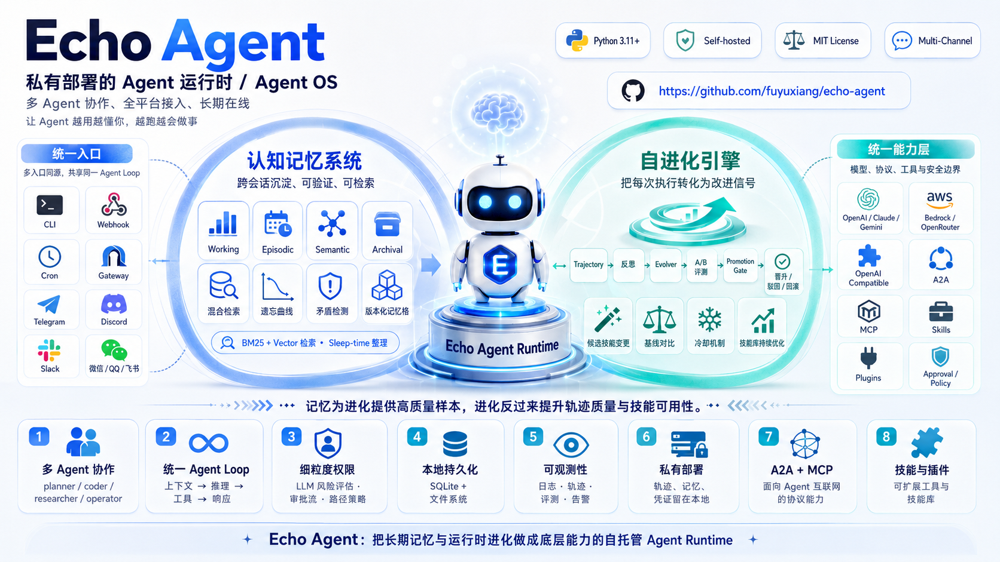
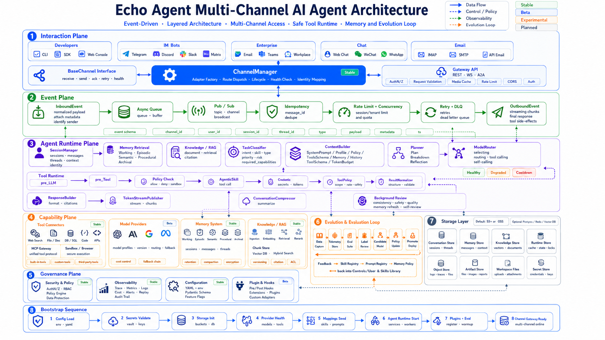

<div align="center">

# Echo Agent

**具备认知记忆与自进化能力的开源 AI Agent**

跨会话沉淀对话、偏好与任务经验，从真实使用轨迹中持续优化自身技能，可在本机或自有服务器上自托管运行

[中文](README.md) · [English](README.en.md)

[](https://github.com/fuyuxiang/echo-agent)
[](https://www.python.org/)
[](pyproject.toml)

<a href="https://github.com/fuyuxiang/echo-agent">
  
</a>

</div>

---

## Echo Agent 是什么

Echo Agent 是一个面向自托管部署的 AI Agent。它在 Agent Loop 之外补齐了两层关键能力：**跨会话留存的认知记忆**，让 Agent 记住对话脉络、用户偏好与任务经验；**基于真实使用轨迹的自进化**，让 Agent 的技能在运行过程中持续打磨，而不是出厂即定型。

CLI、Gateway、Webhook、Cron 与 Telegram、Discord、Slack、企业微信、微信、QQ、飞书、钉钉等消息通道共享同一条消息总线、Agent Loop、记忆库与权限边界。会话、记忆、执行轨迹与本地凭证默认存放在工作区目录，工具调用经统一审批管控。

Echo Agent 的特点可以概括为四个方向：

- 向上：对接大模型——主推理、上下文压缩、向量嵌入、风险审批可分别选择不同 provider 与模型
- 向外：对接消息通道——12 个内置通道经统一消息总线接入同一个 Agent Loop
- 向内：对接认知记忆——四层记忆结构、记忆衰减、矛盾检测，配合 BM25 与向量混合检索
- 向执行层：对接工具与协议——内置工具集、MCP 客户端、A2A JSON-RPC，统一审批管控

**一句话概括：Echo Agent 是一个长期运行的 AI Agent——记得住过去的对话，并能从过去的执行结果中持续改进。**

让 Agent 不再止步于一次性回答，而是带着记忆、技能与可审计的执行历史，长期为你工作。

---

## 最新动态

- **v0.1.0**
  - 自进化引擎：轨迹记录、候选生成、晋升评估三阶段管线
  - 候选晋升前先在评测集上与当前版本逐项对照，指标退步即驳回，支持冷却期与一键回滚
  - 四层认知记忆：Working / Episodic / Semantic / Archival，配合记忆衰减与重要性重排
  - 混合检索：BM25 关键词召回与 FAISS 向量召回融合，按查询特征自适应权重
  - 矛盾检测：写入冲突时保留新旧两版并建立时序关系，读取按时间倒序但旧值仍可追溯
  - 12 个消息通道：CLI、Webhook、Cron、Telegram、Discord、Slack、WhatsApp、Email、Matrix、WeChat、QQ、Feishu、DingTalk、WeCom
  - Gateway HTTP / WebSocket 接口，附带内置 Playground
  - A2A JSON-RPC 端点 + MCP 客户端（含 OAuth）
  - 智能审批：由 LLM 完成风险分类后与策略联合判定
  - 发布说明：[CHANGELOG](https://github.com/fuyuxiang/echo-agent/releases)

---

## 为什么做 Echo Agent

一次性问答用对话产品就够了。Echo Agent 解决的是另一类问题：**Agent 需要跨会话、跨进程长期工作，能记住过去发生了什么，并把过去的执行结果转化为更好的行为**。

要让一个 Agent 真正具备长期工作的能力，下面几件事必须同时做到，缺一项都站不住：

1. 任务执行过程要**结构化记录**——否则无法回看，也无从评估改动是变好还是变差；记忆要**分层组织并随时间衰减**——上下文窗口塞不下所有历史，简单截断又会丢掉关键信息
2. 技能更新要**先验证再生效**——直接让 LLM 改写技能定义会出现明显的能力退化；高风险工具调用要**经统一审批**——`exec`、`write_file` 一旦在错误前提下被授权就难以挽回；多入口（CLI、Gateway、各消息通道）要**共享同一份状态**——否则记忆和权限边界会割裂

Echo Agent 把这些缺失的基础能力一次性补齐，让 Agent 在真实环境里持续运行成为可能。

---

## 核心能力

| 模块 | 说明 |
|------|------|
| Agent Loop | 接收事件、构建上下文、调用模型、执行工具的统一处理循环，跨入口共享同一条执行路径 |
| 认知记忆 | Working / Episodic / Semantic / Archival 四层结构，配合记忆衰减、矛盾检测与重要性重排 |
| 混合检索 | BM25 关键词召回与 FAISS 向量召回融合，按查询特征自适应权重；FAISS 缺失时自动降级 |
| 自进化 | 轨迹记录 → 候选生成 → 晋升评估三阶段管线，候选必须在评测集上不退步才能生效，支持冷却与回滚 |
| 多入口归一 | CLI、Gateway、Webhook、Cron 与 12 个消息通道经消息总线归一为同一种事件 |
| 模型路由 | 按任务类型路由：主推理、上下文压缩、向量嵌入、风险审批可独立配置 provider 与模型 |
| 工具审批 | 三档策略 `manual` / `smart` / `off`，无人值守通道支持 `unattendedPolicy: deny` 默认拒绝 |
| 工具集 | 工作区文件、Shell 执行、Web、协作、记忆、任务、技能、多模态、知识库，并支持 MCP 动态注册 |
| 跨进程互操作 | A2A JSON-RPC（`/a2a` + `/.well-known/agent.json`）与 MCP 客户端（含 OAuth） |
| 凭证与脱敏 | 本地加密凭证存储，工具日志按字段名脱敏（`key`、`token`、`secret` 等） |
| 评测框架 | 评测数据集 + runner，自进化候选必须在评测集上不退步于当前版本才能晋升 |
| 本地优先 | 会话、记忆、轨迹、候选技能、审计日志默认存放在工作区，凭证可加密落盘 |

---

## 架构总览

入口层、运行时核心与改进闭环串成一条完整路径：消息总线归一各入口事件，Agent Loop 在记忆与权限边界内调用模型与工具，执行轨迹回流到自进化管线，再把更新后的技能反馈给后续运行。

<div align="center">
  
</div>

---

## 适用场景

- 希望 Agent 跑在本机或自有服务器上，对工具执行有完整审计与可追溯需求
- 希望对话、偏好、项目事实与任务经验跨会话长期沉淀，而不是每次重新解释
- 希望 Agent 的技能能从真实使用过程中持续打磨，而不是停留在出厂版本
- 希望多个入口（CLI、Webhook、消息机器人）共享同一份记忆与权限边界
- 希望对 `exec`、`write_file` 等高风险工具做强制审批，避免误操作扩散
- 希望同时接入多家模型 provider，并按任务类型分别选择合适的模型

---

## 快速开始

### 方式一：源码启动

环境要求：Python **3.11+**，Linux / macOS / WSL2，至少一个模型 provider 的 API key。推荐使用 [`uv`](https://docs.astral.sh/uv/) 管理虚拟环境。

```bash
git clone https://github.com/fuyuxiang/echo-agent.git
cd echo-agent

uv venv venv --python 3.11
source venv/bin/activate

uv pip install -e ".[all]"
```

国内网络环境可使用阿里云镜像加速：

```bash
uv pip install -e ".[all]" -i https://mirrors.aliyun.com/pypi/simple/
```

配置模型 provider 并启动：

```bash
export OPENAI_API_KEY="sk-..."

echo-agent setup -w .
echo-agent run -w .
```

PowerShell：

```powershell
$env:OPENAI_API_KEY = "sk-..."
echo-agent run -w .
```

CMD：

```cmd
set OPENAI_API_KEY=sk-...
echo-agent run -w .
```

Gitee 镜像（备用）：`https://gitee.com/fuyuxiang/echo-agent.git`

### 方式二：一键安装脚本

仅推荐用于本地开发环境：

```bash
curl -fsSL -o install.sh https://raw.githubusercontent.com/fuyuxiang/echo-agent/master/scripts/install.sh
less install.sh
bash install.sh
```

脚本会写入 `PATH`，并在 Linux 下注册 systemd 服务。生产部署建议采用源码安装，自行管理虚拟环境、凭证与服务注册。

---

## 开发与贡献

### 本地开发

```bash
uv pip install -e ".[all,dev]"

ruff check .
pytest
echo-agent run -w .
```

提交 PR 之前请确保 `ruff check .` 与 `pytest` 通过，并同步更新 `README.md`（中文，主版本）与 `README.en.md`（英文）。

### 社区交流

- 设计讨论、用法咨询、Roadmap 互动：[GitHub Discussions](https://github.com/fuyuxiang/echo-agent/discussions)
- 适合上手的方向：通道适配器、内置工具、MCP 集成、技能示例、评测数据集、文档完善、部署模板
- QQ群：[47572014](https://qm.qq.com/q/JWOPDBNssw)

### 问题反馈

- Bug 与新特性：[GitHub Issues](https://github.com/fuyuxiang/echo-agent/issues)
- 安全相关问题请通过 Issue 选择 `security` 模板私下报告，避免公开复现细节

---

## 开源协议与致谢

### 开源协议

MIT License。许可证声明位于 `pyproject.toml`。

<div align="center">
**具备认知记忆与自进化能力的开源 AI Agent**

<a href="https://github.com/fuyuxiang/echo-agent">GitHub</a> ·
<a href="https://gitee.com/fuyuxiang/echo-agent">Gitee</a> ·
<a href="https://github.com/fuyuxiang/echo-agent/issues">Issues</a> ·
<a href="https://github.com/fuyuxiang/echo-agent/tree/master/docs">完整文档</a>

</div>

---

## Star History

[](https://star-history.com/#fuyuxiang/echo-agent&Date)
