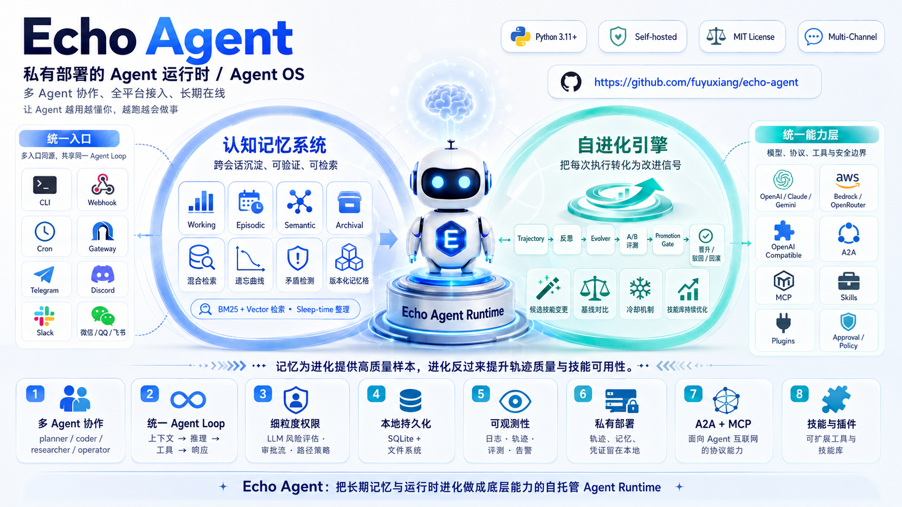
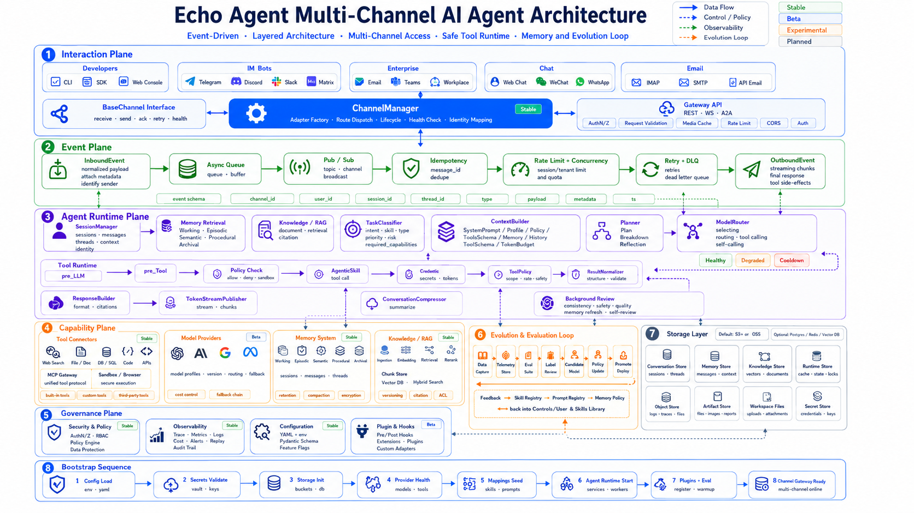

<div align="center">

# Echo Agent

**记得住过去，学得会未来的开源 AI Agent**

<a href="https://github.com/fuyuxiang/echo-agent">
  
</a>

<br/>

[](https://pypi.org/project/echo-agent/)
[](https://pypi.org/project/echo-agent/)
[](https://github.com/fuyuxiang/echo-agent/actions/workflows/ci.yml)
[](https://fuyuxiang.github.io/echo-agent/)
[](LICENSE)
[](https://pepy.tech/project/echo-agent)
[](https://github.com/fuyuxiang/echo-agent)

[中文](README.md) · [English](README.en.md) · [完整文档](https://fuyuxiang.github.io/echo-agent/)

</div>

---

## 一个内核，三种形态

Echo Agent 是一套开源 AI Agent 生态：一个**认知记忆 + 自进化**的内核，撑起三种使用形态。

| 形态 | 是什么 | 位置 |
|------|--------|------|
| **echo-agent** | 可自托管的 Python Agent 运行时，长时记忆、技能进化、14 通道接入 | 本仓库根目录 |
| **Dashboard** | 网关内置的 Web 管理面板，监控会话、记忆、技能、知识与成本 | `web/` |
| **EchoAgent** | 以内核为运行时、可独立打包的桌面 Agent 客户端 | `client/` |

三者共享同一套 Agent 能力：桌面客户端把运行时源码快照内嵌在 `client/vendor/`，无需先装 Python 包；Dashboard 挂在网关根路径，不占独立端口。

---

## 核心亮点

与一次性问答不同，Echo Agent **记得住、学得会**：

- **认知记忆** — Working / Episodic / Semantic / Archival 四层结构，配合艾宾浩斯遗忘曲线（访问越多、忘得越慢）与矛盾检测（信念修正而非静默覆盖），解决长期运行下的记忆膨胀，对话不再从零开始。
- **自进化技能** — 从真实执行轨迹生成候选改进，经评测集对照验证后才晋升，带冷却期与一键回滚，技能越用越强而非出厂定型。
- **多入口归一** — CLI、Gateway、Webhook、Cron 与 Telegram / Discord / Slack / 微信 / 企业微信 / 飞书 / 钉钉 / QQ / WhatsApp / 邮件 / Matrix 共 [14 个通道](https://fuyuxiang.github.io/echo-agent/integrations/channels/)共享同一份记忆与权限。
- **安全可控** — 高风险工具调用经统一审批，凭证加密存储，执行日志可审计。

混合检索、模型路由、MCP / A2A、插件体系、定时任务与输出保全等其余能力，见下方[文档](#文档)中的对应主题。

---

## Dashboard

网关自带 Web 管理面板，启动后访问网关地址即可打开，无需独立端口。页面覆盖系统总览、会话、记忆、技能、知识库、定时任务、任务看板、日志、分析与运行时配置。

> 用 `echo-agent gateway` 启动网关，浏览器访问 `http://127.0.0.1:58123/`（端口由 `gateway.port` 决定）；前端产物用 `echo-agent dashboard build` 构建。详见 [Dashboard](https://fuyuxiang.github.io/echo-agent/guides/dashboard/)。

---

## EchoAgent 桌面客户端

`client/` 是 Tauri 2 桌面应用：React / TypeScript 负责界面，Rust 负责本地能力与内嵌 Agent 运行时。除了对话、代码工作台、知识库、定时自动化与受控的 Browser Use / Computer Use，它的两个杀手锏是：

- **微信接管会话** — 扫码绑定微信后，可把正在进行的任务交给微信继续、在微信里切换任务、确认权限请求、收发附件。桌面运行时处理指令，桌面和微信进入同一会话，桌面关闭后不会执行微信指令。详见 [微信远程对话](client/docs/weixin-remote.md)。
- **组织 · 企业知识资产中枢** — 登录组织后，把团队 / 企业的知识资产接进个人工作区，与本地记忆、个人知识索引共同检索。访问令牌留在 Rust 内存、授权决策留在服务端，桌面只保存 HTTPS 来源与刷新凭据。

<div align="center">
  
</div>

本地开发需要 Node.js、pnpm、Rust stable（最低 1.92）和 `protoc`；macOS 还需 Xcode Command Line Tools，Windows 需 Visual Studio 2022 的"使用 C++ 的桌面开发"工作负载。

```bash
cd client
pnpm install
pnpm tauri dev
```

`pnpm test` 运行前端测试，`pnpm build` 执行 TypeScript 检查与前端生产构建；平台签名就绪后 `pnpm dist` 生成安装包（覆盖 Windows x86_64 与 macOS Apple Silicon / Intel）。发布流程见 [release-workflow.md](client/docs/release-workflow.md)，自动化平台与安全边界见 [automation-platform-support.md](client/docs/automation-platform-support.md)。

---

## 快速开始

环境要求：Python 3.11+，至少一个模型 API Key。

```bash
# 安装
pip install "echo-agent[all]"

# 交互式配置向导（引导录入模型 API Key，数据默认存放在 ~/.echo-agent）
echo-agent setup

# 启动交互式对话
echo-agent run
```

中国大陆网络环境可指定 PyPI 镜像：`pip install "echo-agent[all]" -i https://mirrors.aliyun.com/pypi/simple/`。Windows 下相同的三条命令在 PowerShell 中执行即可。

<details>
<summary>源码安装脚本（Linux / macOS / WSL2）</summary>

`scripts/install.sh` 与 `pip install` 是两条独立路径：它从 Git 仓库克隆源码到 `~/.echo-agent`、创建独立虚拟环境、安装 `[all]` 依赖，并可将网关注册为常驻服务。适用于需要修改源码或希望一步完成常驻部署的场景；只想使用发布版本时用 `pip install` 即可。

脚本先下载到本地再执行，便于执行前审阅内容：

```bash
# GitHub
curl -fsSL -o install.sh https://raw.githubusercontent.com/fuyuxiang/echo-agent/master/scripts/install.sh
# Gitee 镜像（中国大陆网络更快）
curl -fsSL -o install.sh https://gitee.com/fuyuxiang/echo-agent/raw/master/scripts/install.sh

less install.sh && bash install.sh
```

```bash
# 脚本实测两个代码托管的响应速度后自动选择克隆源，也可显式指定：
bash install.sh --repo gitee
bash install.sh --repo github

bash install.sh --reconfigure    # 重新执行配置向导
bash install.sh --skip-setup     # 仅安装代码，不进入配置向导

# 完整选项与环境变量：
bash install.sh --help
```

`--repo` 的作用范围限于 `git clone` / `fetch`。嵌入与精排模型包因分卷托管，始终按 Gitee 优先、GitHub 兜底的顺序下载，不受该参数影响。`--no-mirror-probe` 关闭 PyPI 源、代码托管与 Node.js 镜像三处测速，各自使用第一个默认源。

重复执行脚本即为升级：检测到已有可用配置时跳过配置向导并保留现有配置。

</details>

安装方式的取舍、`[all]` 之外的依赖分组与卸载步骤见[安装文档](https://fuyuxiang.github.io/echo-agent/getting-started/installation/)。

### 常用命令

```bash
echo-agent run              # 交互式对话（终端行输入）
echo-agent setup            # 配置向导（模型、通道、权限等，可反复运行）
echo-agent status           # 查看当前配置状态
echo-agent gateway          # 前台启动常驻网关
echo-agent gateway install  # 把网关注册为后台服务（推荐的常驻方式，见下）
echo-agent cli              # 接入本机常驻网关（默认原生 scrollback）
echo-agent cli --tui        # 可选的全屏 Textual 界面
echo-agent cost             # 查看成本归因报告
echo-agent dashboard build  # 构建 Web Dashboard 前端产物（源码安装时按需执行）
```

> 查看配置项：`echo-agent config explain <配置项>` 查看单项说明（含类型、默认值与可选值）、`echo-agent config dump` 查看当前生效配置（密钥自动脱敏）、`echo-agent config validate` 校验配置文件。

完整子命令与参数见 [CLI 参考](https://fuyuxiang.github.io/echo-agent/reference/cli/)，全部配置项见 [配置参考](https://fuyuxiang.github.io/echo-agent/reference/configuration/)。

### 常驻运行（后台服务）

`echo-agent run` 和 `echo-agent gateway` 都是前台进程，关掉终端就退出。想让 agent 7×24 常驻，把网关注册为系统服务即可（macOS 注册用户级 LaunchAgent，Linux 注册用户级 systemd 服务，均无需 root，开机自启、崩溃自动拉起）：

```bash
echo-agent gateway install    # 注册后台服务
echo-agent gateway start      # 启动
echo-agent gateway status     # 查看运行状态
echo-agent gateway logs -f    # 跟踪日志
echo-agent gateway restart    # 重启（升级 echo-agent 后执行一次）
echo-agent gateway stop       # 停止
echo-agent gateway uninstall  # 取消注册
```

网关运行后，在本机任意终端用 `echo-agent cli` 接入，即可与同一个常驻 agent 对话（会话独立、记忆共享）。网关仅监听本机 loopback（127.0.0.1），不支持远程地址；远程接入请走 ssh。

两点环境差异需要注意：Linux 的用户级服务随登录会话结束而停止，执行 `sudo loginctl enable-linger $USER` 可使其在退出登录后继续运行；未启用 systemd 的环境（WSL2 默认配置、容器）改用 tmux 维持前台进程，如 `tmux new -s echo-agent 'echo-agent gateway'`。系统级注册与服务文件更新见[后台常驻服务](https://fuyuxiang.github.io/echo-agent/operations/background-service/)。

> **本机访问边界**：零配置下的 loopback 网关只接受两类客户端——`echo-agent cli`，以及不携带浏览器 `Origin` 的原生客户端（脚本、SDK）。携带跨站 `Origin` 的浏览器请求一律拒绝，防止网页借用户浏览器驱动本机 agent（CSRF）。开放浏览器或 playground 访问的配置方式见[网关认证](https://fuyuxiang.github.io/echo-agent/integrations/gateway/authentication/)。

配对码客户端在验证失败时会收到明确的错误状态：请求格式不合法为 `400`，配对码无效或过期为 `403`，同一身份触发临时锁定为 `429` 并附带 `Retry-After` 等待时间。输入限制及锁定规则见[网关认证](https://fuyuxiang.github.io/echo-agent/integrations/gateway/authentication/#配对失败锁定)。

---

## 文档

完整文档在 **[fuyuxiang.github.io/echo-agent](https://fuyuxiang.github.io/echo-agent/)**，本 README 覆盖安装与上手部分。

| 主题 | 入口 |
|------|------|
| 开始使用 | [安装](https://fuyuxiang.github.io/echo-agent/getting-started/installation/) · [升级与卸载](https://fuyuxiang.github.io/echo-agent/getting-started/upgrade-uninstall/) |
| 核心概念 | [架构](https://fuyuxiang.github.io/echo-agent/concepts/architecture/) · [记忆系统](https://fuyuxiang.github.io/echo-agent/concepts/memory-system/) · [技能进化](https://fuyuxiang.github.io/echo-agent/concepts/evolution-evaluation/) · [安全模型](https://fuyuxiang.github.io/echo-agent/concepts/security-model/) |
| 使用指南 | [模型接入](https://fuyuxiang.github.io/echo-agent/guides/models/) · [工具与权限](https://fuyuxiang.github.io/echo-agent/guides/tools-permissions/) · [知识库](https://fuyuxiang.github.io/echo-agent/guides/knowledge-base/) · [成本](https://fuyuxiang.github.io/echo-agent/guides/cost-control/) |
| 集成 | [通道](https://fuyuxiang.github.io/echo-agent/integrations/channels/) · [网关](https://fuyuxiang.github.io/echo-agent/integrations/gateway/) · [MCP](https://fuyuxiang.github.io/echo-agent/integrations/mcp/) · [A2A](https://fuyuxiang.github.io/echo-agent/integrations/a2a/) · [插件](https://fuyuxiang.github.io/echo-agent/integrations/plugins/) |
| 运维与参考 | [部署](https://fuyuxiang.github.io/echo-agent/operations/) · [CLI](https://fuyuxiang.github.io/echo-agent/reference/cli/) · [配置项](https://fuyuxiang.github.io/echo-agent/reference/configuration/) |

---

## 架构

<div align="center">
  
</div>

各组件的职责边界与数据流见[架构总览](https://fuyuxiang.github.io/echo-agent/concepts/architecture/)，仓库目录结构见[代码地图](https://fuyuxiang.github.io/echo-agent/development/repository-map/)。

---

## 适用场景

- 对话、偏好与任务经验需要跨会话长期沉淀，而非每次从零开始
- 希望 Agent 的技能从真实使用中持续进化，而非出厂定型
- 多入口（CLI、Webhook、消息机器人、桌面客户端）需共享同一份记忆与权限
- 高风险工具需要强制审批，避免误操作

生产部署的形态选择、资源规划与加固清单见[运维文档](https://fuyuxiang.github.io/echo-agent/operations/)。

---

## 开发与贡献

从源码搭建开发环境：

```bash
git clone https://github.com/fuyuxiang/echo-agent.git   # 或 https://gitee.com/fuyuxiang/echo-agent.git
cd echo-agent
uv venv venv --python 3.11 && source venv/bin/activate
uv pip install -e ".[all,dev]"
```

提交前在本地运行与 CI 相同的检查：

```bash
ruff check .
pytest
```

### 提交 PR

- 从 `master` 切出特性分支，一个 PR 只处理一个主题。
- 涉及面向用户的改动时，同步更新 `README.md` 与 `README.en.md`；改动文档时同步中英文两份。
- 修改配置项后运行 `echo-agent config gen-docs` 重新生成配置参考。
- PR 模板中的检查项请逐条确认；CI 会运行 lint、测试、安全扫描、Dashboard 构建、文档构建与打包六项检查。

完整约定见 [CONTRIBUTING](CONTRIBUTING.md)，开发环境与调试方式见[开发文档](https://fuyuxiang.github.io/echo-agent/development/setup/)。

### 参与方向

| 方向 | 入口 |
|------|------|
| 通道适配器 | [新增通道](https://fuyuxiang.github.io/echo-agent/development/add-channel/) |
| 内置工具 | [新增工具](https://fuyuxiang.github.io/echo-agent/development/add-tool/) |
| 模型 Provider | [新增 Provider](https://fuyuxiang.github.io/echo-agent/development/add-provider/) |
| 技能与插件 | [技能编写](https://fuyuxiang.github.io/echo-agent/development/skill-authoring/) · [插件 API](https://fuyuxiang.github.io/echo-agent/development/plugin-api/) |
| 评测数据集 | [测试与评测](https://fuyuxiang.github.io/echo-agent/development/testing-evaluation/) |
| 文档 | [文档贡献](https://fuyuxiang.github.io/echo-agent/development/documentation/) |

### 交流

| 渠道 | 用途 |
|------|------|
| [GitHub Issues](https://github.com/fuyuxiang/echo-agent/issues) | 缺陷报告与功能提案，含 Bug / Feature 两类模板 |
| [GitHub Discussions](https://github.com/fuyuxiang/echo-agent/discussions) | 使用问题、设计讨论与经验分享 |
| QQ 群 [47572014](https://qm.qq.com/q/JWOPDBNssw) | 即时交流 |

行为准则见 [CODE_OF_CONDUCT.md](CODE_OF_CONDUCT.md)。

---

## 版本与兼容性

当前 `0.3.x`，处于 Beta。版本号采用语义化版本格式；具体兼容性以各版本更新说明为准：

- **PATCH**（`0.3.x`）通常用于修复；升级前仍应阅读更新说明并备份。
- **MINOR**（`0.x.0`）在 Beta 阶段可能包含配置或数据结构的破坏性变更；逐版本阅读更新说明。SQLite 表结构迁移在数据库初始化时自动执行；`echo-agent migrate` 仅用于 USER 记忆归属迁移和旧记忆分片导入。
- 配置项与插件 / 技能接口的调整会在 [CHANGELOG](CHANGELOG.md) 中逐项标注。

升级前建议备份工作区目录。详细流程见[升级与迁移](https://fuyuxiang.github.io/echo-agent/operations/upgrade-migrations/)，各接口的稳定级别见[兼容性说明](https://fuyuxiang.github.io/echo-agent/reference/compatibility/)。

## 安全

漏洞请通过 GitHub [私密安全报告](https://github.com/fuyuxiang/echo-agent/security/advisories/new)提交，我们在 48 小时内确认接收。披露流程与支持版本见 [SECURITY.md](SECURITY.md)。

部署侧的安全边界与加固清单见[安全模型](https://fuyuxiang.github.io/echo-agent/concepts/security-model/)与[安全加固](https://fuyuxiang.github.io/echo-agent/operations/security-hardening/)。

---

## 协议

[MIT License](LICENSE)
