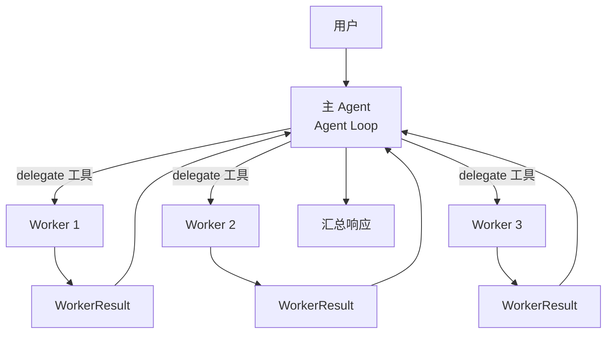
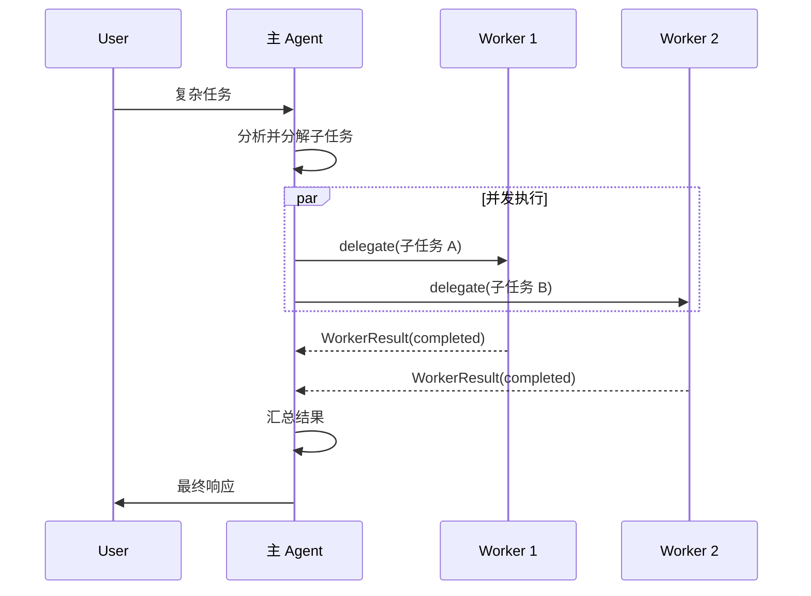
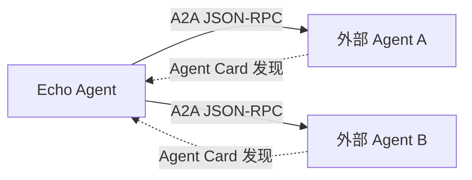

# 多 Agent 协作

Echo Agent 支持将复杂任务分解后委派给多个 Worker Agent 并发执行，由主 Agent 汇总结果。本机制通过 `delegate` 工具实现，适用于可并行化的多步骤任务。

## 协作架构



## 1. Worker Profile

Worker 通过预定义的 Profile 模板配置：

```python
@dataclass(frozen=True)
class WorkerProfile:
    id: str
    name: str
    description: str = ""
    instructions: str = ""          # Worker 专属指令
    default_tools: tuple[str, ...]  # 可用工具子集
    model: str = ""                 # 可独立指定模型
    provider: str = ""
    max_iterations: int = 12        # 迭代上限
    max_tokens: int = 8192
    temperature: float = 0.4
```

Profile 限定了 Worker 的能力边界——每个 Worker 只能使用 `default_tools` 声明的工具，遵循最小权限原则。

## 2. delegate 工具

主 Agent 通过 `delegate` 工具发起委派：

- 指定 Worker Profile 或使用默认配置
- 描述子任务目标和约束
- 可并发发起多个 delegate 调用

## 3. 执行结果 WorkerResult

```python
@dataclass
class WorkerResult:
    task_index: int
    status: str = "completed"  # completed | failed | timeout
    output: str = ""
    error: str = ""
    iterations: int = 0
    tool_calls: int = 0
    duration_seconds: float = 0.0
    model: str = ""
    metadata: dict[str, Any] = field(default_factory=dict)
```

Worker 执行完成后返回结构化结果，主 Agent 可根据 status 判断是否需要重试或降级。

## 4. WorkerToolOutcome

Worker 内部的工具调用结果：

```python
@dataclass(frozen=True)
class WorkerToolOutcome:
    text: str
    success: bool = True
```

区分成功与失败，使 Worker 循环能判断进展而非盲目重试。

## 5. 执行时序



## 6. 安全与隔离

- **工具限制**：Worker 只能访问 Profile 中 `default_tools` 声明的工具
- **迭代上限**：`max_iterations` 防止 Worker 无限循环
- **审计追踪**：每个 Worker 的工具调用都记录在审计日志中（`audit.py`）
- **错误隔离**：单个 Worker 失败不影响其他 Worker 和主 Agent

## 7. A2A 协议集成

除内部 Worker 委派外，Echo Agent 还支持通过 A2A（Agent-to-Agent）协议与外部 Agent 协作：



- **Agent Card**：描述 Agent 能力的元数据，用于服务发现
- **JSON-RPC**：标准化的任务委派协议
- **agents_list 工具**：列出已知的可协作 Agent
- **agents_route 工具**：根据任务类型路由到合适的 Agent

## 8. 内部模块结构

| 模块 | 职责 |
|------|------|
| `multi_agent/models.py` | WorkerProfile, WorkerResult 数据结构 |
| `multi_agent/runtime.py` | Worker 执行运行时 |
| `multi_agent/registry.py` | Worker Profile 注册表 |
| `multi_agent/audit.py` | 委派审计日志 |
| `multi_agent/error_messages.py` | 错误消息定义 |
| `tools/delegate.py` | delegate 工具实现 |
| `a2a/protocol.py` | A2A 协议实现 |
| `a2a/client.py` | A2A 客户端 |

!!! question "需维护者确认"
    Worker 的并发度上限是否有全局配置？当前代码中 delegate 工具的并发调用数似乎由工具并发分区策略（tool_concurrency.py）统一控制，但未见独立的 worker 并发配置项。
