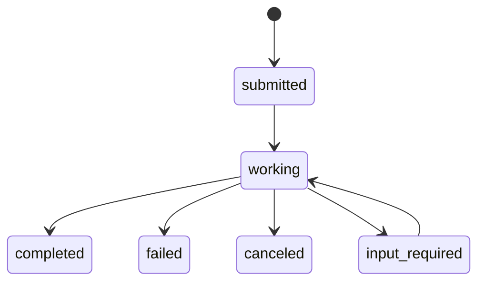

# A2A (Agent-to-Agent)

Echo Agent 支持 A2A 协议，实现 Agent 间的任务委派。

---

## 概述

A2A 使 Agent 能够相互发现并通过标准化的 JSON-RPC 协议委派任务。Echo Agent 可同时作为 A2A 服务端（接收任务）和客户端（向其他 Agent 发送任务）。

## Agent Card

通过 `GET /.well-known/agent.json` 提供 Agent 描述卡片：

```json
{
  "name": "echo-agent",
  "description": "A modular AI agent framework",
  "url": "http://localhost:58123",
  "version": "0.3.7",
  "capabilities": {"streaming": false, "pushNotifications": false},
  "skills": [{"id": "chat", "name": "chat"}, {"id": "tool_use", "name": "tool_use"}],
  "authentication": {"schemes": ["bearer"]}
}
```

## JSON-RPC 端点

`POST /a2a`

### 方法

| 方法 | 说明 |
|------|------|
| `tasks/send` | 提交任务（同步请求/响应） |
| `tasks/get` | 查询任务状态 |
| `tasks/cancel` | 取消任务 |

### 任务状态流转



## 配置

Gateway 运行时自动启用 A2A。通过 `a2a` 配置节进行配置。

## 作为客户端

Agent 可通过 `delegate` 工具向远程 A2A Agent 发送任务：

```
请帮我把这个任务委派给 http://other-agent:58123 处理
```

## 限制

- 不支持流式响应（`tasks/sendSubscribe` 未实现）
- 不支持推送通知
- 仅处理文本内容
- 会话标识格式：`a2a:{task_id}`
- 任务存储有 TTL（默认 3600 秒）和数量上限（默认 1000）
