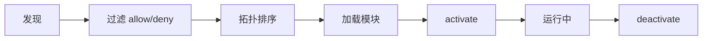

# 开发 Plugin

Echo Agent Plugin 开发指南。

---

## Plugin 结构

```
my-plugin/
├── plugin.yaml          # 清单文件（必须）
├── __init__.py          # 入口模块
└── tools/
    └── my_tool.py       # 自定义工具
```

## 清单文件 (plugin.yaml)

```yaml
name: my-plugin
version: "1.0.0"
description: "插件功能说明"
author: "作者"
requires_env: [MY_API_KEY]
provides:
  tools: [my_custom_tool]
  hooks: [pre_tool_call, post_tool_call]
kind: integration
config_key: my_plugin
depends_on: []
permissions: []
```

## 入口模块

```python
from echo_agent.plugins import PluginContext

async def activate(ctx: PluginContext):
    """插件加载时调用。"""
    # 注册工具
    ctx.tool_registry.register(MyTool(ctx.plugin_config))
    
    # 注册钩子
    ctx.hook_registry.register("pre_tool_call", my_hook)

async def deactivate(ctx: PluginContext):
    """关闭时调用。"""
    pass
```

## PluginContext

通过 `ctx` 可访问：

| 属性 | 说明 |
|------|------|
| `ctx.config` | 全局 Echo Agent 配置 |
| `ctx.workspace` | 工作区路径 |
| `ctx.bus` | MessageBus 事件总线 |
| `ctx.tool_registry` | 工具注册/注销 |
| `ctx.hook_registry` | 生命周期钩子注册 |
| `ctx.plugin_config` | 本 Plugin 配置（来自 `plugins.config.{config_key}`） |

## 权限模式

```yaml
plugins:
  permissionMode: strict  # strict | compat | legacy
```

| 模式 | 行为 |
|------|------|
| `strict` | Plugin 声明越权时拒绝加载 |
| `compat` | 警告但允许 |
| `legacy` | 全部允许（不推荐） |

## 分发方式

1. **本地目录** — 放置在 plugins 目录或 `plugins.extraDirs` 指定的路径
2. **Python 包** — 通过 pyproject.toml 的 `[project.entry-points."echo_agent.plugins"]` 注册

## CLI 管理

```bash
echo-agent plugin list      # 列出已安装插件
echo-agent plugin info <name>   # 查看插件详情
echo-agent plugin enable <name>  # 启用
echo-agent plugin disable <name> # 禁用
echo-agent plugin check          # 检查所有插件状态
```

## 生命周期


