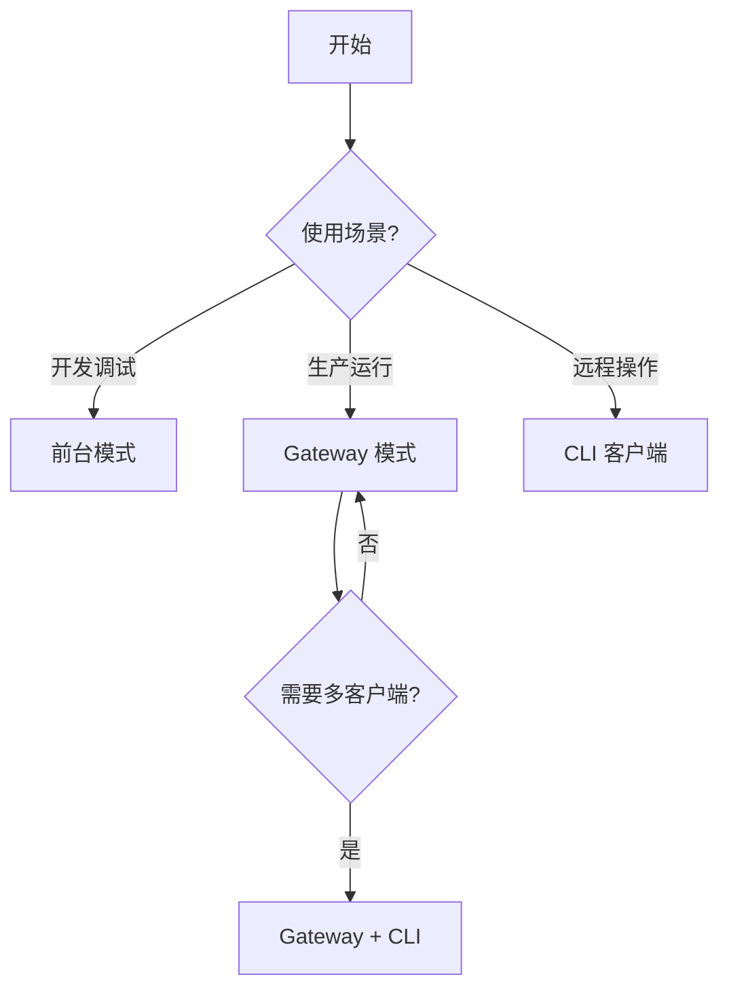

# 运行模式

Echo Agent 提供三种运行模式，适用于从本地开发到生产部署的不同场景。

---

## 模式对比

| 特性 | 前台模式 (`run`) | Gateway 模式 | CLI 客户端 |
|------|-----------------|-------------|-----------|
| 启动命令 | `echo-agent run` | `echo-agent gateway start` | `echo-agent cli` |
| 进程生命周期 | 随终端退出 | 系统服务托管 | 随终端退出 |
| 记忆持久化 | 是 | 是 | 依赖 Gateway |
| 多客户端接入 | 否 | 是 | — |
| 适用场景 | 开发调试 | 生产运行 | 远程操作 |
| 资源占用 | 完整运行时 | 完整运行时 | 仅网络客户端 |
| 自动重启 | 否 | 是（systemd/launchd） | — |

---

## 前台模式

最简单的运行方式，适合开发和调试：

```bash
echo-agent run
```

进程在当前终端前台运行，所有日志直接输出到 stdout/stderr。关闭终端或 `Ctrl+C` 即停止。

### 典型用途

- 本地开发与调试
- 功能验证
- 配置测试
- 单次任务执行

### 配置示例

运行模式由启动命令决定，不是配置项 —— `runtime` 节只有 `single_instance` 一个字段，没有 `mode`。日志级别配在 `observability`：

```yaml
# ~/.echo-agent/config.yaml
observability:
  log_level: DEBUG    # 前台调试常用更详细的日志

runtime:
  single_instance: true   # 同一工作区只允许一个实例
```

!!! tip "调试技巧"
    日志级别只能通过配置文件或 `ECHO_AGENT_OBSERVABILITY__LOG_LEVEL=DEBUG` 环境变量设置，`echo-agent run` 没有 `--log-level` 参数。

---

## Gateway 模式

生产环境推荐模式。Gateway 以后台服务形式运行，提供 HTTP API 供多个客户端接入：

```bash
# 安装为系统服务
echo-agent gateway install

# 启动服务
echo-agent gateway start

# 查看状态
echo-agent gateway status

# 查看日志
echo-agent gateway logs
```

### 架构概览

```
┌─────────────┐     ┌─────────────┐     ┌─────────────┐
│  CLI Client │     │  Dashboard  │     │  API 调用方  │
└──────┬──────┘     └──────┬──────┘     └──────┬──────┘
       │                   │                   │
       └───────────────────┼───────────────────┘
                           │ HTTP (localhost)
                    ┌──────▼──────┐
                    │   Gateway   │
                    │  (后台服务)  │
                    ├─────────────┤
                    │ Agent 运行时 │
                    │ 记忆 / 知识库 │
                    │ 工具执行引擎  │
                    └─────────────┘
```

### Gateway 环境标识

Gateway 进程启动时会设置环境变量 `_ECHO_AGENT_GATEWAY=1`，用于内部逻辑区分运行上下文。插件和工具可通过此变量判断当前是否在 Gateway 环境中运行。

### 认证配置

Gateway 支持三种认证模式：

| 模式 | 说明 | 适用场景 |
|------|------|---------|
| `open` | 无认证，任何本地请求可访问 | 仅本地开发 |
| `allowlist` | 基于 Token 白名单 | 多用户共享 |
| `pairing` | 配对码认证 | 首次设备接入 |

```yaml
# ~/.echo-agent/config.yaml
gateway:
  host: 127.0.0.1
  port: 58123
  auth:
    mode: allowlist
    api_tokens:
      - "token-user-alice"
      - "token-user-bob"
    admin_tokens:
      - "token-admin-root"
    token_header: "X-Echo-Agent-Token"
    allowed_origins:
      - "http://localhost:3000"
    allowed_hosts:
      - "localhost"
```

!!! warning "网络绑定"
    默认绑定 `127.0.0.1`，仅接受本地连接。如需远程访问，请先完成 [安全加固](security-hardening.md) 再修改绑定地址。

### 服务管理命令

```bash
echo-agent gateway install    # 注册系统服务
echo-agent gateway uninstall  # 移除系统服务
echo-agent gateway start      # 启动
echo-agent gateway stop       # 停止（60 秒超时）
echo-agent gateway restart    # 重启
echo-agent gateway status     # 查看运行状态
echo-agent gateway logs       # 查看日志
```

!!! question "需维护者确认"
    Gateway stop 的 60 秒超时是否可通过配置调整？当前硬编码为 60 秒。

---

## CLI 客户端模式

CLI 客户端连接到已运行的 Gateway，提供与前台模式一致的交互体验：

```bash
echo-agent cli
```

### 工作原理

CLI 客户端本身不运行 Agent 逻辑，而是通过 HTTP API 与 Gateway 通信：

```
┌──────────────┐         ┌──────────────┐
│  echo-agent  │  HTTP   │   Gateway    │
│     cli      │────────▶│   (远端)     │
└──────────────┘         └──────────────┘
```

### 连接配置

```bash
# 通过环境变量
export ECHO_AGENT_GATEWAY_URL=http://localhost:58123
export ECHO_AGENT_TOKEN=your-api-token
echo-agent cli

# 通过命令行参数
echo-agent cli --gateway http://localhost:58123 --token your-api-token
```

### 适用场景

- 从远程机器操作 Gateway
- 多终端同时接入同一 Agent 实例
- 轻量级客户端环境（无需安装完整依赖）

---

## 模式选择建议



!!! tip "从前台迁移到 Gateway"
    开发阶段使用 `echo-agent run` 验证配置无误后，执行 `echo-agent gateway install && echo-agent gateway start` 即可切换到生产模式，配置文件完全通用，无需修改。
